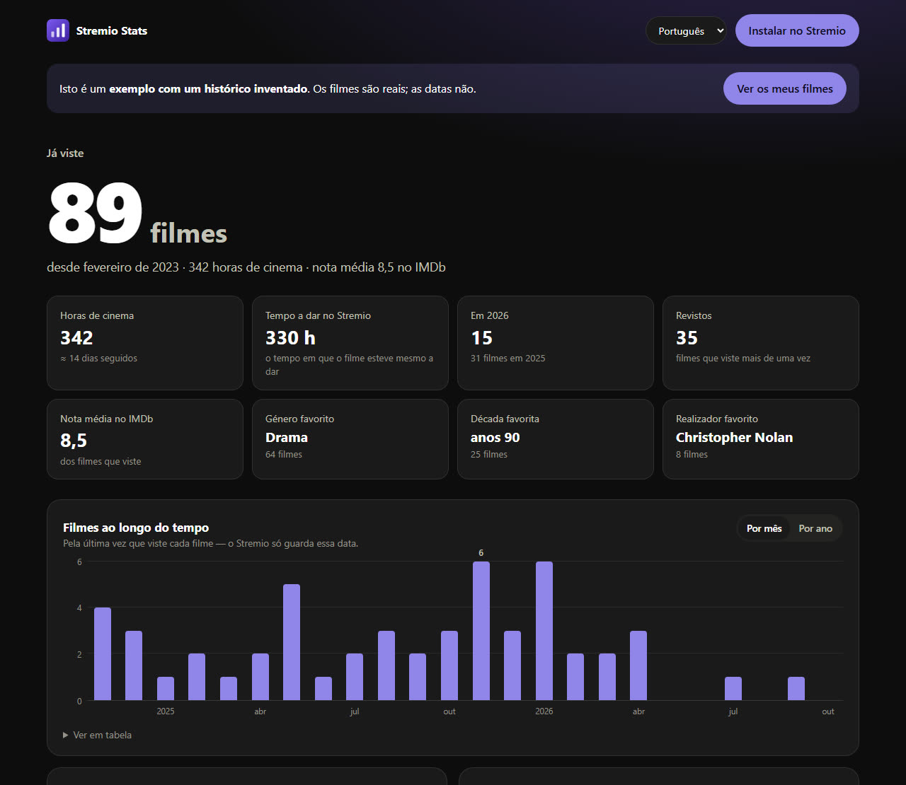
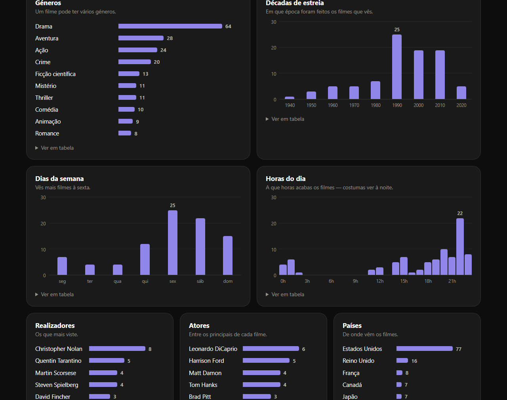
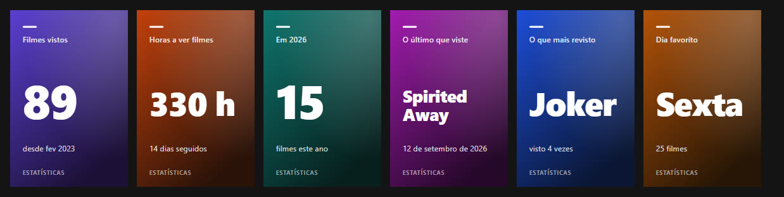

# Stremio Stats

**Estatísticas de todos os filmes que já viste no Stremio — num painel no navegador e dentro do próprio Stremio.**

👉 **[stremiostats.stream](https://stremiostats.stream)** · [ver o exemplo](https://stremiostats.stream/?exemplo)



O Stremio guarda o histórico de tudo o que vês, mas não mostra nada sobre ele. O Stremio Stats lê esse histórico
(com a tua autorização), junta-lhe os detalhes de cada filme e mostra-te quantos filmes viste, quantas horas
passaste a ver cinema, de que géneros, décadas, realizadores e atores gostas mais, e em que dias e a que horas vês.

## O que mostra

**No painel (navegador)**

- **Os números principais** — filmes vistos, horas de cinema, tempo real de reprodução, filmes este ano,
  filmes revistos, nota média no IMDb, género, década e realizador favoritos.
- **Filmes ao longo do tempo** — por mês (últimos dois anos) ou por ano.
- **Géneros, décadas de estreia, dias da semana e horas do dia.**
- **Realizadores, atores e países** que mais aparecem no que vês.
- **Destaques** — melhor e pior nota, o mais longo, o mais curto, o mais antigo, o que mais reviste.
- **Filmes que ficaram a meio.**
- **A lista de todos os filmes**, com capa, pesquisa, filtro por género e por ano em que os viste, várias ordens,
  e um botão para **descarregar tudo em Excel**.

Cada gráfico tem dicas ao passar o rato (com os nomes dos filmes) e uma vista em tabela.



**Dentro do Stremio (extensão)**

Depois de instalada, a extensão junta duas filas à página inicial do Stremio:

- **As minhas estatísticas** — cartões com os números principais. Cada cartão abre uma página com mais pormenor
  (os últimos filmes, os mais revistos, os dias da semana em barras, os melhores meses…).
- **Filmes que já vi** — todos os filmes vistos, que em *Descobrir* se podem ordenar por mais recentes,
  mais antigos, mais revistos ou de A a Z.

O botão **Configurar** da extensão abre o painel completo.



**Em cinco línguas** — português, inglês, francês, espanhol e italiano. O painel escolhe a língua do navegador
(e há um seletor no topo); a extensão fica na língua escolhida no momento da instalação.

## Como usar

1. Abre **[stremiostats.stream](https://stremiostats.stream)**.
2. Carrega em **Entrar com a minha conta do Stremio**: aparece um código de 4 letras, que confirmas na página
   oficial do Stremio — o mesmo sistema que o Stremio usa para ligar uma televisão. Também dá para entrar com
   email e palavra-passe.
3. Vê as tuas estatísticas. Para as teres também dentro do Stremio, carrega em **Instalar no Stremio**.

Queres ver primeiro como é? Há um **[exemplo com um histórico inventado](https://stremiostats.stream/?exemplo)**.

## Privacidade

- **A palavra-passe nunca passa pelo Stremio Stats.** Com o código de 4 letras nem chega a ser escrita; com
  email e palavra-passe vai diretamente do teu navegador para o Stremio.
- O painel guarda, só no teu navegador, a chave de sessão que o Stremio lhe dá para ler a biblioteca.
  **Sair** apaga-a.
- O link de instalação da extensão leva essa chave **cifrada** (AES-GCM) — quem visse o link não ficava com
  acesso à conta, só às estatísticas. Mesmo assim, é pessoal: não o partilhes.
- Não há base de dados nem registos: nada do teu histórico fica guardado no servidor.

## Limitações

- **O Stremio só guarda a última vez que viste cada filme.** As contas por mês, dia e hora usam essa data: um
  filme visto em 2021 e reaberto em 2023 conta em 2023.
- **Filmes marcados como vistos todos de uma vez** (ou importados) ficam com a data desse momento. Como ninguém
  acaba dois filmes com menos de 20 minutos de intervalo, o Stremio Stats reconhece-os, deixa-os fora das contas
  por data e mostra-os como "sem data certa".
- Os géneros, realizadores, atores, países, notas e durações vêm do **Cinemeta**, o catálogo oficial do Stremio,
  que às vezes tem erros (por exemplo, no ano de estreia).
- Só conta filmes; as séries ficam de fora.

---

## In English

**Stremio Stats** shows statistics about every movie you've watched on [Stremio](https://www.stremio.com):
how many, hours watched, genres, release decades, directors, actors, countries, favourite days and times,
IMDb ratings, rewatches and unfinished movies — in a web dashboard and, as an add-on, inside Stremio itself
(a "My statistics" row of stat cards and a "Movies I've watched" row). Available in English, Portuguese,
French, Spanish and Italian. Try it at **[stremiostats.stream](https://stremiostats.stream)** or see the
[example](https://stremiostats.stream/?exemplo&lang=en).

Sign-in uses Stremio's own device-link code (or email/password sent straight to Stremio). Your library is read
from Stremio's API and enriched with Cinemeta; nothing is stored server-side.

---

## Para quem quer mexer no código

Corre num **Cloudflare Worker**, sem frameworks nem dependências no navegador: HTML, CSS e JavaScript simples.

| Ficheiro | O que faz |
|---|---|
| `src/worker.js` | A extensão do Stremio (manifesto, filas, cartões em SVG) e o servidor do painel |
| `public/index.html`, `painel.js`, `estilo.css` | O painel |
| `public/estatisticas.js` | As contas — partilhado pelo painel e pelo Worker |
| `public/textos.js` | Todos os textos nas cinco línguas — partilhado pelo painel e pelo Worker |
| `src/demo.json` | Biblioteca de exemplo (filmes reais, datas inventadas); refaz-se com `bun run demo` |

**Pôr uma cópia a funcionar** (precisa de [Bun](https://bun.sh) e de uma conta Cloudflare):

```bash
bun install
echo "SEGREDO=$(openssl rand -base64 32)" > .dev.vars   # chave para cifrar os links de instalação
bun run dev                                           # http://localhost:8010 (o exemplo está em /?exemplo)
```

Para publicar: `bunx wrangler secret put SEGREDO` (uma vez) e `bun run deploy`. Mudar o `SEGREDO` invalida os
links de instalação que já existam. O domínio está em `wrangler.toml`.

**Endereços da extensão:** `/<cfg>/manifest.json`, `/<cfg>/catalog/movie/…`, `/<cfg>/meta/movie/mvest:….json`,
`/<cfg>/configure` (painel). `<cfg>` é a chave cifrada, ou `demo` / `demo-en` / `demo-fr`… para o exemplo.

---

*Projeto independente, sem ligação ao Stremio. "Stremio" é uma marca dos seus donos.*
