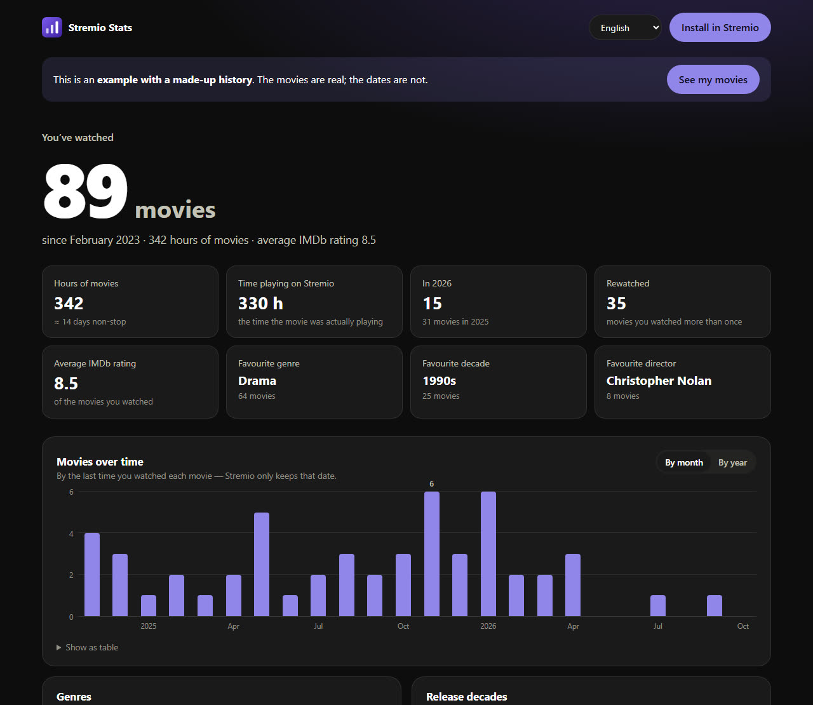
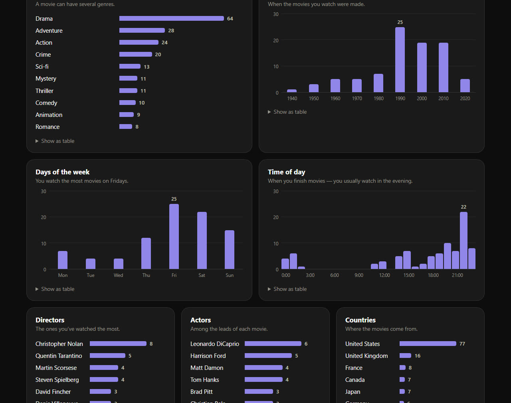
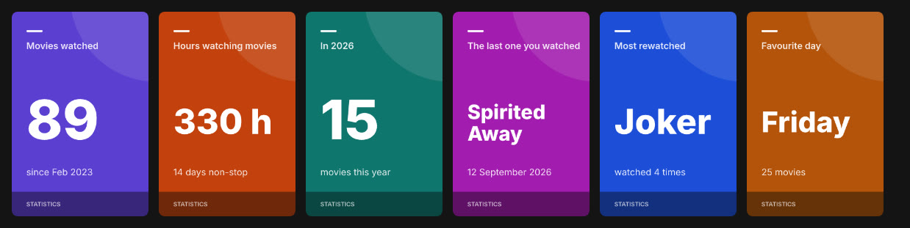

# Stremio Stats

**Statistics for every movie you've watched on Stremio — in a web dashboard and right inside Stremio.**

👉 **[stremiostats.stream](https://stremiostats.stream)** · [see the example](https://stremiostats.stream/?exemplo&lang=en)



Stremio keeps a history of everything you watch, but never shows you anything about it. Stremio Stats reads that
history (with your permission), adds the details of each movie, and shows you how many movies you've watched,
how many hours you've spent on them, which genres, decades, directors and actors you like most, and on which days
and at what times you watch.

## What it shows

**In the dashboard (web browser)**

- **The headline numbers** — movies watched, hours of movies, actual playback time, movies this year,
  rewatched movies, average IMDb rating, favourite genre, decade and director.
- **Movies over time** — by month (last two years) or by year.
- **Genres, release decades, days of the week and times of day.**
- **The directors, actors and countries** that show up most in what you watch.
- **Highlights** — best and worst rated, the longest, the shortest, the oldest, the one you rewatched most.
- **Movies you left halfway.**
- **The full list of your movies**, with posters, search, filters by genre and by the year you watched them,
  several sort orders, and a button to **download everything as an Excel file**.

Every chart has hover tooltips (listing the movies) and a table view, and **clicking any bar opens a page with all of its movies** — every movie from March 2025, every drama, every Christopher Nolan film, everything you watched on Fridays…



**Inside Stremio (add-on)**

Once installed, the add-on adds two rows to Stremio's home screen:

- **My statistics** — cards with the headline numbers. Each card opens a page with more detail
  (your latest movies, the most rewatched, days of the week as bars, your best months…).
- **Movies I've watched** — every movie you've watched, which you can sort in *Discover* by most recent,
  oldest, most rewatched or A to Z.

The add-on's **Configure** button opens the full dashboard.



**Five languages** — English, Portuguese, French, Spanish and Italian. The dashboard follows your browser's
language (and has a language picker at the top); the add-on uses the language chosen when you install it.

## How to use it

1. Go to **[stremiostats.stream](https://stremiostats.stream)**.
2. Click **Sign in with my Stremio account**: a 4-letter code appears, which you confirm on Stremio's official
   page — the same system Stremio uses to connect a TV. Signing in with email and password also works.
3. See your statistics. To get them inside Stremio as well, click **Install in Stremio**.

Want to see what it looks like first? There's an **[example with a made-up history](https://stremiostats.stream/?exemplo&lang=en)**.

## Privacy

- **Your password never goes through Stremio Stats.** With the 4-letter code you don't even type it; with email
  and password it goes straight from your browser to Stremio.
- The dashboard keeps, only in your browser, the session key Stremio gives it to read your library.
  **Sign out** deletes it.
- The add-on's install link carries that key **encrypted** (AES-GCM) — anyone who saw the link would get your
  statistics, not access to your account. It's still personal: don't share it.
- No database, no logs: none of your history is stored on the server.

## Limitations

- **Stremio only keeps the last time you watched each movie.** The month, day and time charts use that date: a
  movie watched in 2021 and reopened in 2023 counts in 2023.
- **Movies marked as watched all at once** (or imported) get the date of that moment. Since nobody finishes two
  movies less than 20 minutes apart, Stremio Stats recognises them, leaves them out of the date-based charts and
  lists them as "no reliable date".
- Genres, directors, actors, countries, ratings and runtimes come from **Cinemeta**, Stremio's official catalogue,
  which sometimes has mistakes (release years, for example).
- Only movies are counted; series are left out.

## For developers

It runs on a **Cloudflare Worker**, with no frameworks and no client-side dependencies: plain HTML, CSS and
JavaScript. (The code and its comments are in Portuguese.)

| File | What it does |
|---|---|
| `src/worker.js` | The Stremio add-on (manifest, catalogs, stat cards) and the dashboard server |
| `src/cartao.js` | The stat-card design (SVG), turned into PNG with [resvg](https://github.com/RazrFalcon/resvg) because Stremio's phone and TV apps don't show SVG |
| `public/index.html`, `painel.js`, `estilo.css` | The dashboard |
| `public/estatisticas.js` | The statistics — shared by the dashboard and the Worker |
| `public/textos.js` | Every piece of text in the five languages — shared by the dashboard and the Worker |
| `src/demo.json` | Example library (real movies, made-up dates); regenerate it with `bun run demo` |

**Running your own copy** (needs [Bun](https://bun.sh) and a Cloudflare account):

```bash
bun install
echo "SEGREDO=$(openssl rand -base64 32)" > .dev.vars   # key used to encrypt install links
bun run dev                                           # http://localhost:8010 (the example is at /?exemplo)
```

To publish: `bunx wrangler secret put SEGREDO` (once) and `bun run deploy`. Changing `SEGREDO` invalidates any
existing install links. The custom domain is set in `wrangler.toml`.

**Add-on routes:** `/<cfg>/manifest.json`, `/<cfg>/catalog/movie/…`, `/<cfg>/meta/movie/mvest:….json`,
`/<cfg>/configure` (dashboard). `<cfg>` is the encrypted key, or `demo` / `demo-en` / `demo-fr`… for the example.

---

*Independent project, not affiliated with Stremio. "Stremio" is a trademark of its owners.*
